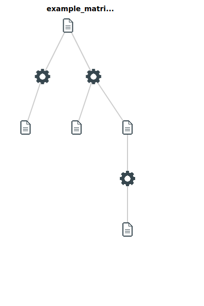

# Exporting your workspace history

To help get an overview of the analyses you have run, we offer a graphical view of your files and analyses under the "analysis flow" tab in the workspace. As an example:

If you hover over the various icons, you can see the files that were input or output from each analysis task, represented by the "gear" icon. In this way, you can see how the various files were created and how everything came together. Clicking on the gear icons will take you to the results tab where you can view the result of that analysis.

Finally, by exporting the workflow history, you will have a record of all your analysis versions, parameters, etc. necessary to recreate the same steps on a different dataset. This allows you to run fully reproducible, multi-step workflows at any point in the future. While the exported file is not particularly "human readable", it is useful for serving as a kind of receipt or full history of your analysis.