# Case study: RNA-Seq

## Importing files

When we initially log-in, the file browser shows that you have no files:

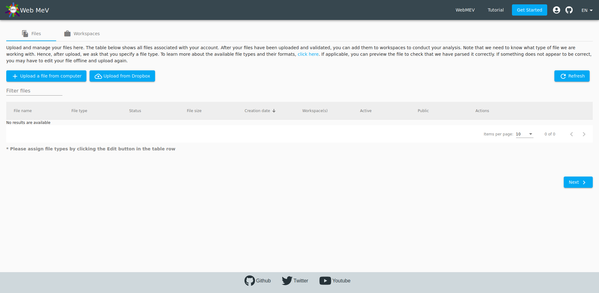

Upload from your local machine. Here we show the upload of the RNA-seq counts file, which looks like:

|       | Sample_A | Sample_B | ... | Sample_T |
|-------|---------|---------|-----|---------|
| geneA | 2       | 5       | ... | 54      |
| geneB | 101     | 102     | ... | 8       |
| ...   | 56      | 51      | ... | 56      |

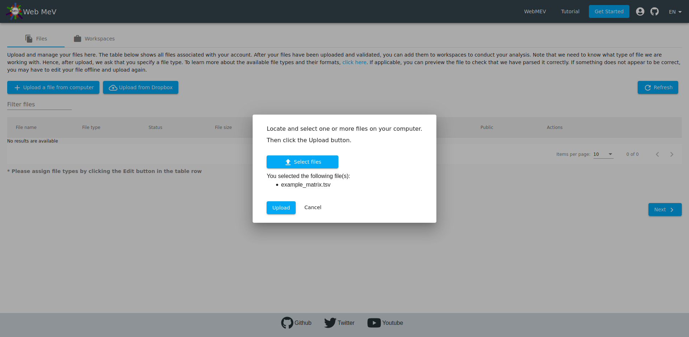

In addition to the prepared RNA-seq counts, we also have an "annotation file". This file gives sample metadata, or data *about the samples themselves*. In our example, the annotation file tells us that some of the samples were derived from cultures of monocytes while others came from CD4 cells. Additionally, it lists the sequencing "batch". We don't use that in this walkthrough, but one could use that variable to assess if there were any noticeable batch effects that we should adjust for.

|  sample_id     | cell_type | sequencing_run |
|-------|---------|---------|
| sample_D | Monocytes      | run1      | 
| sample_C | Monocytes    | run1     | 
| sample_S   | CD4      | run1      | 
|...|...|...|
| sampleT   | CD4      | run1      | 

## Defining file types

After upload, we need to tell WebMeV what types of files these are. Note that the file name shows up in red text to alert us about this. We choose "RNA-seq count matrix" and "Annotation file"

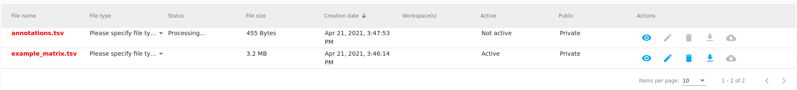

After setting the file types, WebMeV will attempt to parse and validate. If successful, you will see that the files are "active" without any warnings.

As a double-check, we click on the "eyeball" icon to view a preview. Everything looks good. Generally, if something was incorrectly formatted, then the file will not pass validation.

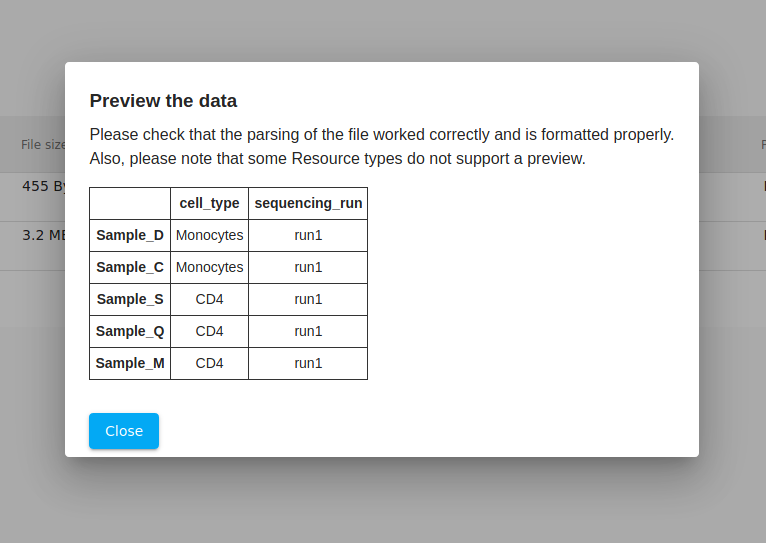

## Creating a new workspace

Now that the files are uploaded and ready, we switch to the "workspaces" tab. Initially this is empty. Clicking the button opens a dialog where we enter the name of the workspace. Choose a simple, descriptive name ("mev-demo" in this case). Then click on the link to enter this new workspace

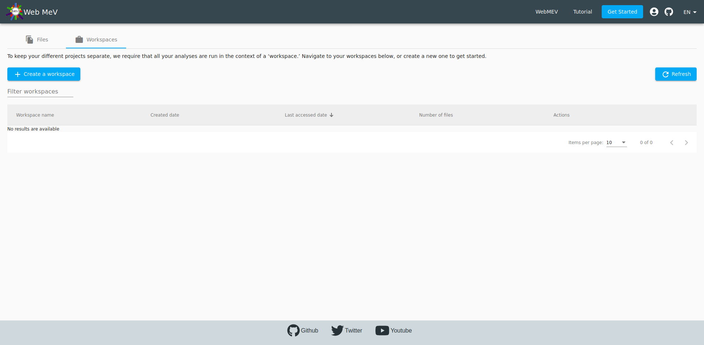

## Adding data to the workspace

After creating the workspace and clicking on the link, the workspace view is opened. Initially the workspace is empty. Note the empty table in the file browser. Your uploaded files still exist, but the table is empty since they have not been added to this particular workspace.

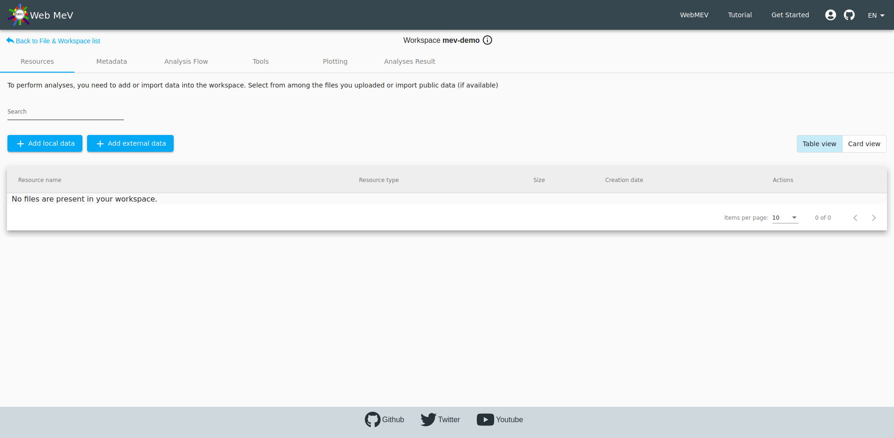

Clicking on the "add local data" from above, we can select which files we want to import into this workspace.

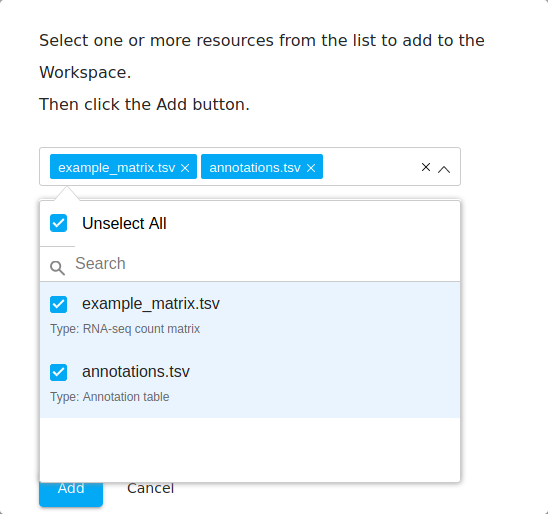

## Running analyses

Navigate to the "tools" tab and look at the list of options for analysis tools. Below, we show how to initiate a principal component analysis (PCA).

Next to each input field, the question mark icon will provide help and explanation for that analysis input. For a PCA analysis, we only require the input RNA-seq count matrix. There is also an optional input for executing the PCA on a subset of samples, but we leave that blank.

As mentioned in the how-to guide, inputs that correspond to input files will be populated with *all available files* that match the expected type. *Sometimes the input does not make sense for a given analysis, so the presence of a particular file as an input option does not mean that it is necessarily appropriate for that analysis*.

After filling everything out, we click "Run" and wait...

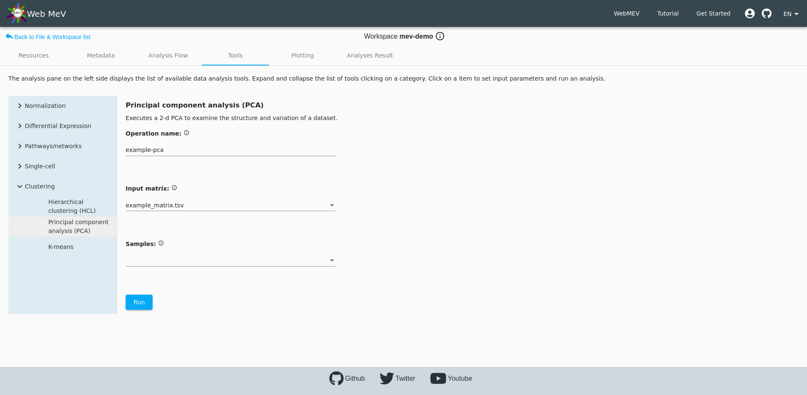

## Exploring the PCA output

After the PCA completes, the interface will update to show the PCA projection plot. This is a "simplified" 2-dimensional representation of your data. Typically, samples with similar expression profiles or phenotypes will cluster together. Each data point represents a single sample. From the plot, we can see two general clusters- one on the left side of the plot and the other on the right.

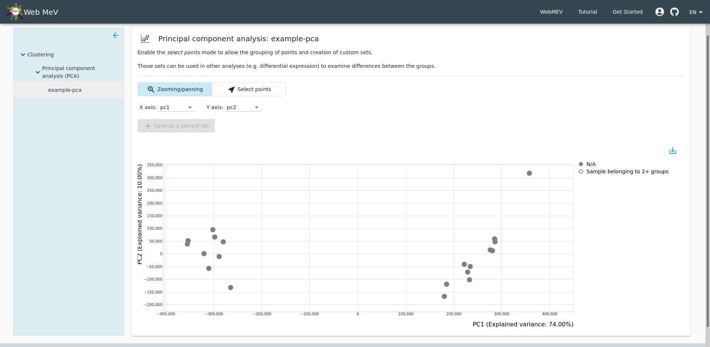

Since WebMeV is interactive, we can now use this PCA clustering to begin investigating these samples. We click the "select points" button (shown in light blue) to toggle the "drag and draw" functionality. With this, we are able to select the points in each cluster. Below, we show only a single cluster, but we do this for both the left and right clusters.

Note that when the samples are selected, you are told that you have selected "sample_A", "sample_B", and so on. We then click the "Save as a sample set" button, which opens up a popup dialog (see below).

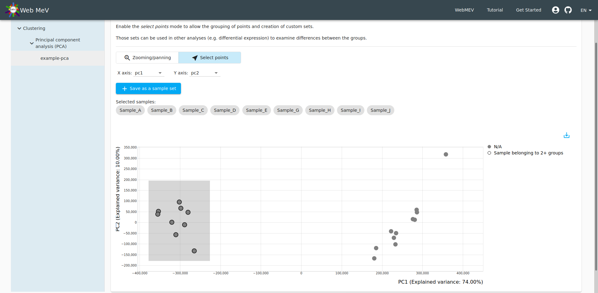

That popup allows us to define a custom "observation set" and choose a color to represent that group of samples. Note that in WebMeV's terminology an "observation" is a sample and a "feature" is a gene. We use those more general terms to avoid confusion in situations where the data does not correspond to biological samples or specifically genes.

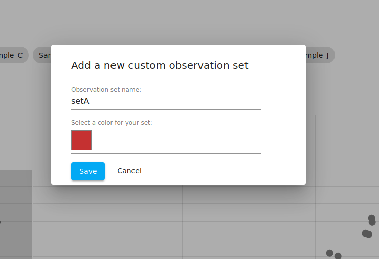

We do this for both clusters and name them "setA" and "setB". If you navigate to the "metadata" tab, you can see that the table now shows both of these:

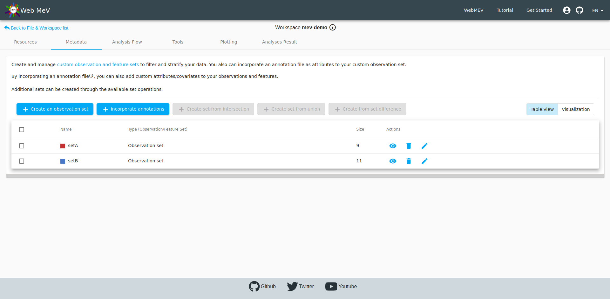

You may now click on one of the set to see the samples corresponding to the set.

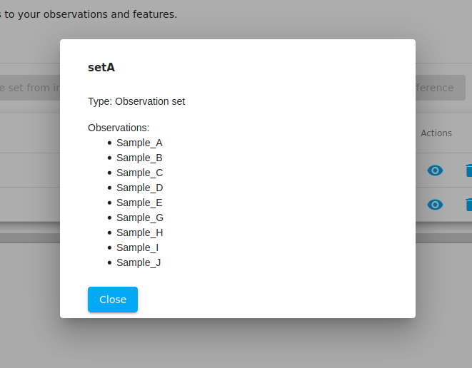

## Incorporating annotations

Recall that due to the sequencing experiment, we had prior knowledge of each cell type (monocytes, CD4). Given what we are dealing with two distinct cell types, we might expect that the two clusters we identified in the PCA directly correspond with these.

If you go to the "metadata" tab and click on the "incorporate annotations" file, you will be presented with a popup where you may select from any annotation files that you have in your workspace. If you have not uploaded and set any files of this type, then this option will not be enabled.

In our annotation file, we had two colums named "cell_type" and "sequencing_run". For the moment, we select "cell_type" as the annotation attribute since we are interested in how the PCA clusters correspond to the biological annotations. 

We can then choose to incoporate the information from this column. We select all to bring in all the information about cell types. 

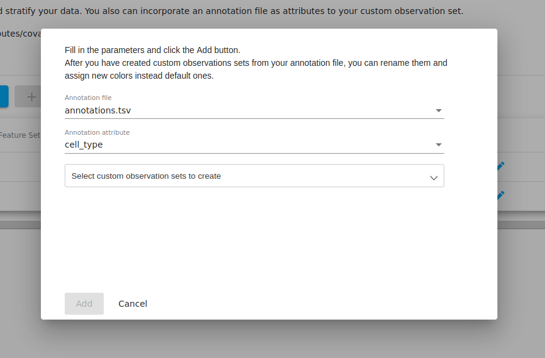

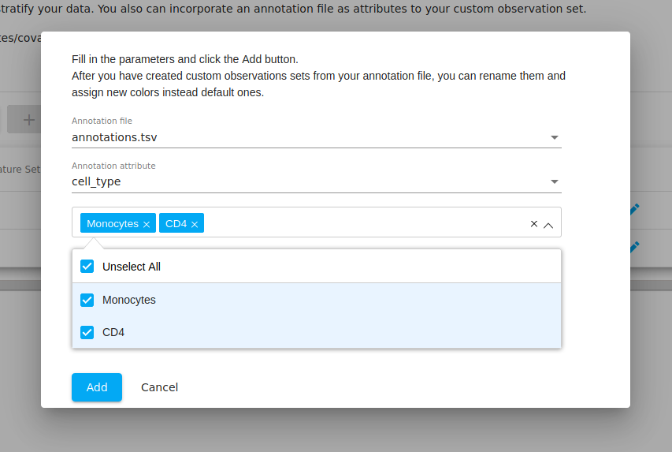

After clicking "add" above, we now see that two new "observation sets" were created-- one for the monocytes and one for the CD4 cells, each with 10 samples in each.

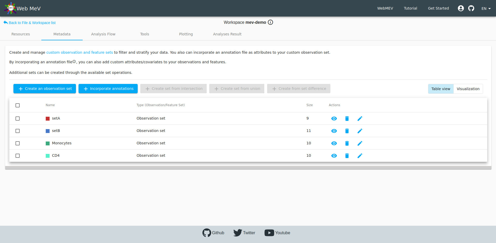

If we now select the "visualization" view to the top-right of the table, we can see a graphic representation of how the samples fall into the various groups.

We immediately see that the samples in setA are *almost* equivalent to the samples annotated as monocytes. **However**, we see that "sample_F" does not seem to agree. Perhaps there was an error in your annotation file?? According to the PCA, sample_F showed an expression pattern more similar to your CD4 samples since it clustered with the other samples which all matched the CD4 annotation. 

Note that errors in annotations are more common than you think and it is important to do this type of investigation/QC. In public datasets, running a PCA using chrX/chrY expression can sometimes reveal expression patterns that are incongruous with the clinical annotation for sex.

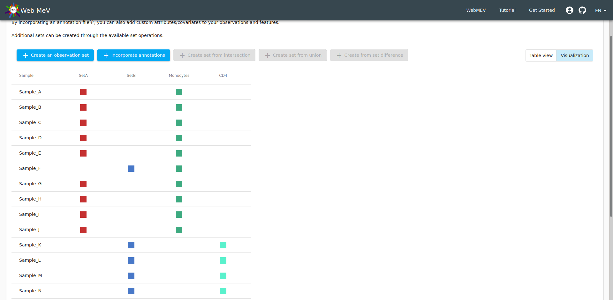

## Running a differential expression analysis

We next run a differential expression analysis using R/Bioconductor's DESeq2 software. 

The inputs to this analysis include the count matrix (same as with the PCA), but we also have options for defining the names of the contrasted groups and which samples we should contrast.

Note that had you attempted to do this analysis before PCA *or* without first incorporating your CD4/monocytes annotations, you would **not** be able to execute the differential expression analysis; the dropdown input field for these inputs would be blank. This is because a differential expression analysis requires you to compare two observation sets (groups of samples). When we first started, we did not have this information so this would not be possible.

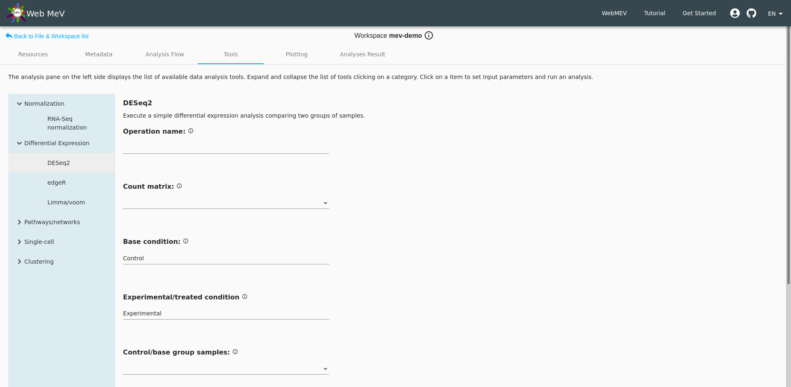

Note that we have several options for our contrast groups. We could either choose to compare the groups that came from the PCA (setA, setB) *or* we could choose to compare the CD4 and monocyte annotations. We choose to contrast CD4 and monocytes below.

Note that there is no logic that would prevent one from contrasting setB and monocytes, which would be comparing two sets of samples that are effectively the same. However, upon starting the analysis, the software would identify that the samples overlap and subsequently fail/stop the analysis.

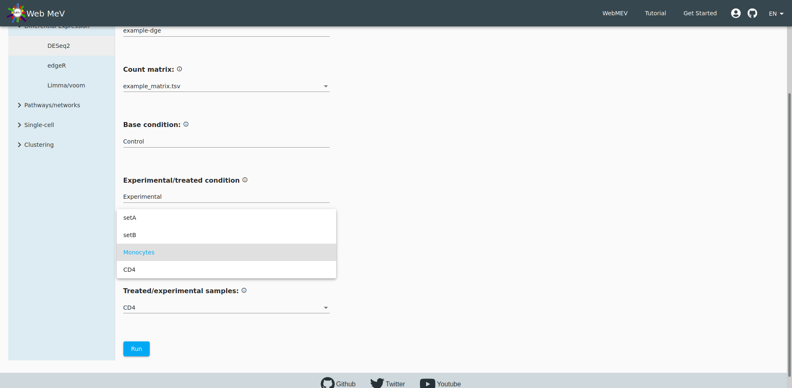

The output from the DESeq2 differential gene expression is presented as a table *and* boxplot. In the screenshot below, the boxplot is out of the viewing frame. However, by filtering the table, we can control which genes are shown in the boxplot directly below.

By setting thresholds for the fold-change and adjusted p-value, we can filter the table down to a set of genes which show the strongest evidence for differential expression.

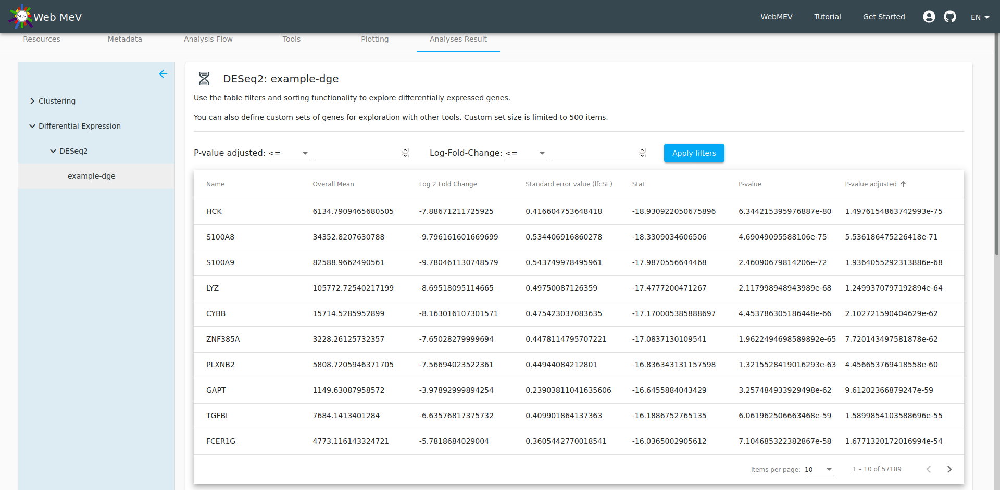

If the size of the remaining genes is small enough (less than 500 genes, which may change), a button will activate which will allow you to define a custom "feature set". Below, we call this set "topDGE" to represent the "top" differentially expressed genes. Note that we set the filters to select genes with a very low adjusted p-value and a log fold-change *less than 6* (which gives very strongly downregulated genes when comparing CD4 to monocytes)

If you go to the metadata tab, you will see this new gene/feature set shown in the table.

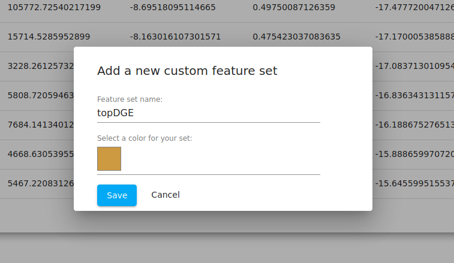

## Plot an expression heatmap

At this point, we have a list of our top differentially expressed genes. Perhaps we are interested in making a heatmap of these genes. We then head to the "Plotting" tab in the workspace and select "expression heatmap".

For the expression data source, we choose the "normalized" expression that was one of the outputs of the differential expression analysis. We then choose "topDGE" as the genes/features to plot.

After playing with some of the plotting parameters, we arrive at a reasonable heatmap. Note the relatively dark strip corresponding to "sample_F". *As we suspected, this expression pattern matches much better with the monocytes, adding further evidence that the annotation file contained an error.*

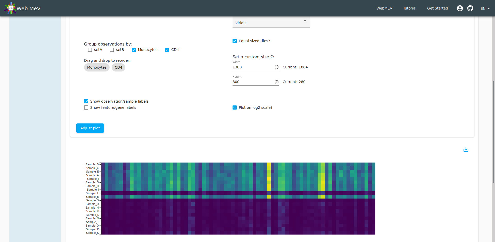

## Gene-set enrichment analysis

Now, given that we have run a differential expression, we can dig further and start to look at potential biological mechanisms underpinning this data. We now run a gene-set enrichment analysis as implemented in the R/Bioconductor fGSEA package.

One of the inputs to fGSEA is a table that allows the software to rank the genes. Typically, this is done as a combination of the log-fold change and p-value of differential expression. 

In principle, one could upload a file with this information directly, but most often we plug the output of the differential expression analysis into fGSEA.

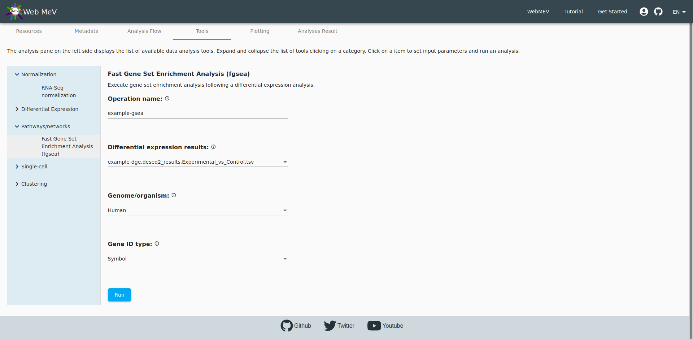

The output of the analysis is a table of the top pathways that *may* be affected the differentially expressed genes we previously identified. The details of fGSEA are outside the scope of this tutorial, but one can think of fGSEA as taking the ranked list of genes and overlaying them onto the database of biological pathways; if many of the genes in a particular pathway are differentially expressed, then it is reasonable to expect that the pathway would be different between the two cell types. This can start to reveal the biological meaning behind the differentially expressed genes.

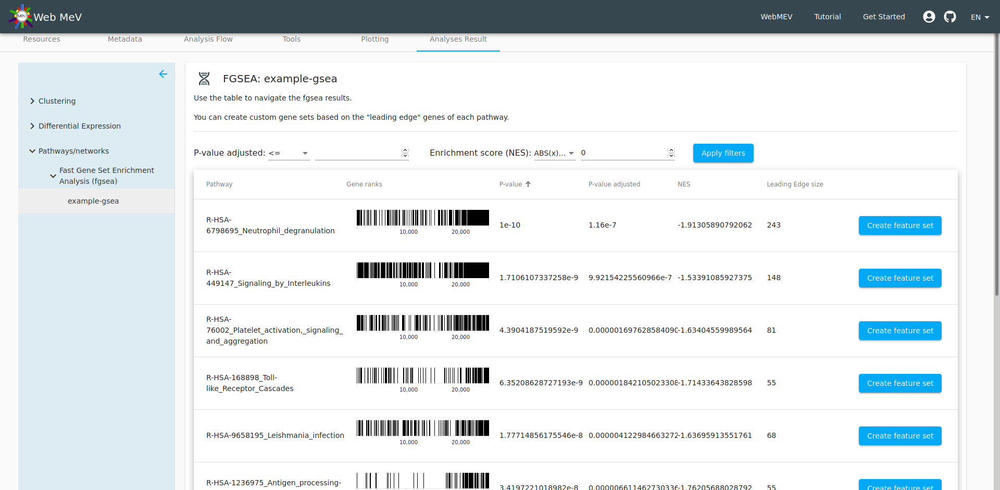

At this point, we can now choose one of the pathways and "export" the genes in that pathway to its own "feature set". By default, the set name is given as the name of the pathway from the fGSEA database, but you are free to change that. We leave it as the default here.

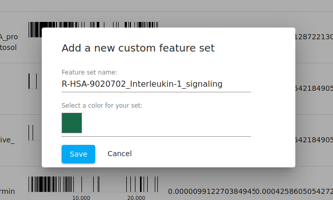

## Feature set operations

Again, if we head to the metadata tab, we can see all the observation and feature sets, including this new set based on the IL-1 signaling pathway. We also see our "topDGE" set which was taken from the DESeq2 differential expression analysis.

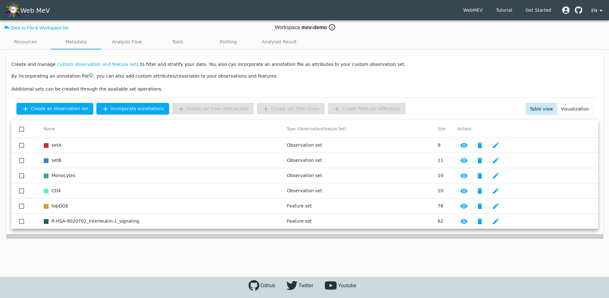

Perhaps we are interested in viewing those top *downregulated* differentially-expressed genes that are *also* in the IL-1 signaling pathway. Recall that fGSEA simply looks at how the full, ranked list of genes falls within the 62 genes in this pre-defined pathway. It doesn't mean that all 62 genes are differentially expressed or *how* they are affected (i.e. up- or downregulated). 

We can find out this intersection by selecting the two gene sets and performing a feature intersection by clicking on the button to "Create set from intersection". This ends up creating a new set of three genes. Thus, out of the 62 genes in the IL-1 signaling pathway, only three are strongly downregulated comparing CD4 versus .

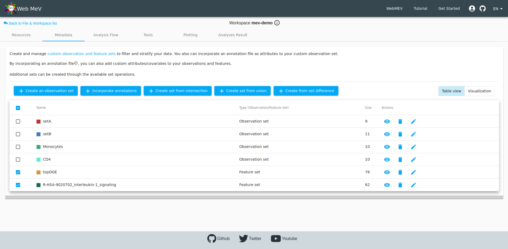

## Boxplot of expressions

As a final step in our analysis, let's look at the expression of those three *significantly downregulated* genes in the IL-1 pathway. Go to the "Plotting" tab again and this time choose "expression boxplot". Again, we select the normalized expressions, but this time we choose to display the three genes in our "intersection set". We arrive at the boxplot shown below.

Again, if you hover over the individual points, we can see sample_F with gene expressions that more closely align with CD4 cell expression. Indeed, if you choose "setA" and "setB" to segregate the expressions, we see an improvement with no "outliers". If it weren't obvious before, we have definitively shown that sample_F was incorrectly annotated (see the final screenshot).

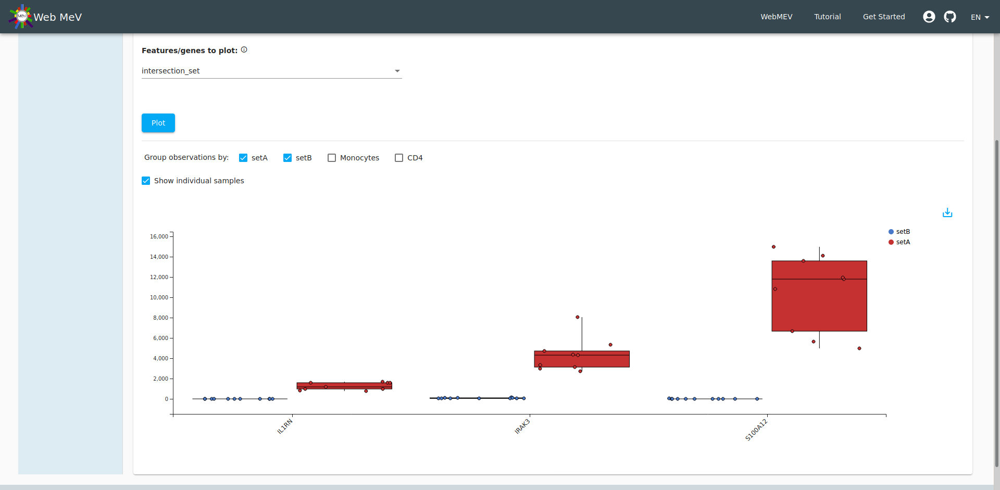